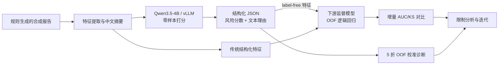

<div align="center">

# 🏦 LLM-PBOC-Credit-Risk

**用本地 LLM 把征信报告转成 label-free 风险特征，再接入下游风控模型**

*LLM-as-Feature · Zero-shot Credit-Risk Scoring for a Downstream Model*

[](https://www.python.org/)
[](https://pytorch.org/)
[](https://github.com/vllm-project/vllm)
[](https://huggingface.co/Qwen)
[](https://developer.nvidia.com/cuda-toolkit)
[](LICENSE)
[](#-项目概览)

**1,200 份合成报告 · 单张 16 GB 消费级 GPU · 端到端 4.3 份/s · 全流程无需微调**

[技术亮点](#-技术亮点) · [快速开始](#-快速开始) · [实验结果](#-实验结果与解读) · [Prompt 工程](#-prompt-工程) · [工程复盘](#-工程取舍与复盘) · [已知限制](#-已知限制) · [路线图](#-路线图)

</div>

> [!NOTE]
> 本项目基于**程序化生成的合成数据**：指标反映的是模型对生成器风险分层的恢复能力，而非真实客群上的违约预测性能。阅读下文所有数字时请以此为前提。

## 🎯 项目概览

本项目把本地 LLM 当作**零样本特征抽取器**：让 Qwen3.5-4B 在**不接触标签**的前提下，对每份征信报告输出一个风险分数；这个 label-free 分数再作为一个**无监督特征**，和传统结构化特征（DTI、利用率、逾期次数……）一起喂进下游监督风控模型（纯 numpy 逻辑回归 + 5 折 OOF），用**增量 AUC / KS** 检验它是否带来传统特征之外的信号。

> 这样定位也顺带化解了"标签循环性"批评：LLM 出分时看不到标签，因此把它当特征接入下游监督模型在方法上是干净的。

完整链路：生成 1,200 份分层合成报告 → 特征工程与中文摘要 → Qwen + vLLM 零样本打分 → **下游模型特征融合与 OOF 对比** → 保序校准诊断。

当前实现覆盖：

- 程序化生成分层合成报告与标签；
- DTI、信用卡利用率、近期逾期等特征提取；
- vLLM 连续批处理、前缀缓存和结构化 JSON 解码；
- **下游监督模型：仅传统特征 vs 传统 + LLM 分数的 OOF 增量对比**；
- 无 GPU 的规则版 mock 流程；
- AUC、KS、Brier、Lift 与阈值分析；
- OOF 保序校准实验。

结构化输出和自然语言理由便于研究与人工复核，但不等于经过验证的 PD、忠实归因或合规解释。

## ✨ 技术亮点

| 方向 | 具体实现 |
|---|---|
| 🖥️ 本地推理工程 | vLLM 连续批处理 + 前缀缓存 + BF16，单张 16 GB 消费级 GPU 跑完 1,200 份报告 |
| 🧠 Prompt 设计 | 角色 + 方法论锚点 + 风险分层 + 输出契约四层结构，system 前缀静态可缓存 |
| 🧩 结构化输出 | JSON Schema 约束解码 + 贪心解码，直接产出可解析的风险字段与文本理由 |
| 🧱 下游特征融合 | 把 LLM 零样本分数当 label-free 特征接入 OOF 逻辑回归，量化其对传统特征的增量 |
| 📐 风控指标 | 手写实现 AUC / KS / Brier / Lift，并显式区分 tie-aware 与乐观口径 |
| 🎚️ 概率校准 | 5 折 OOF 保序回归（PAV）校准实验与诊断 |
| 🔬 工程诚实度 | 如实报告 LLM 特征增量微弱的 null 结果，并记录标签循环性、指标偏差与复现缺口 |

## 🔄 工作流



## 🚀 快速开始

### 1. 环境

当前代码在以下本机环境验证：WSL2 Ubuntu 24.04、Python 3.13、PyTorch 2.11、vLLM 0.25.1、Transformers 5.x、CUDA 13。

```bash
python -m pip install -r requirements.txt      # 或：python -m pip install "vllm==0.25.1" numpy
```

仓库目前没有依赖锁文件；不同 GPU、CUDA 和编译器组合可能需要额外适配。Qwen3.5 的线性注意力内核会在运行时 JIT 编译，需要可用的 C/C++ 编译器与 CUDA 工具链。

### 2. 生成合成数据

```bash
cd scripts
python generate_samples.py
```

脚本会在 `data/samples/` 生成 1,200 份报告及 `_index.json`。生成器使用固定随机种子（`random.seed(42)` / `np.random.seed(42)`），且所有日期锚定到固定的 `REPORT_DATE`（2026-05-09），不再依赖运行时系统时间——因此**重新生成时原始 JSON 与 Qwen 输入均逐字节确定**（见[输入可复现性](#输入可复现性)）。

### 3. 无 GPU 冒烟测试

```bash
python qwen_inference.py \
  --backend mock \
  --limit 8 \
  --output_dir ../output/smoke
```

完整 mock 流程会写入默认评估路径：

```bash
python qwen_inference.py --backend mock
python evaluate.py
python calibrate.py
```

> [!CAUTION]
> 推理脚本会覆盖目标目录中的 `predictions.jsonl`。冒烟测试建议始终使用独立的 `--output_dir`。

### 4. GPU / vLLM 推理

环境已经配置完成时，可以直接运行：

```bash
python qwen_inference.py \
  --backend vllm \
  --model_path /absolute/path/to/Qwen3.5-4B
```

仓库还提供 `run_inference.sh`，用于作者本机的 CUDA/JIT 环境。该脚本包含虚拟环境、CUDA 和 Conda 的本机路径，使用前需要按实际环境修改，不能视为通用启动器。

### 5. 评估 · 下游模型 · 校准诊断

```bash
python evaluate.py        # LLM 分数单独的原始指标
python risk_model.py      # 下游模型：仅传统特征 vs 传统 + LLM 分数（OOF 增量对比）
python calibrate.py       # LLM 原始分数的保序校准诊断
python input_manifest.py  # 把每份 Qwen 输入的 sha256 钉成可审计指纹
```

`risk_model.py` 用纯 numpy 逻辑回归 + 5 折 OOF，输出两套特征的 AUC/KS/Brier 对比并写入 `output/downstream_metrics.json`。`calibrate.py` 当前输出的是 OOF 诊断分数，不会持久化可用于新样本的最终校准器，也不会按校准后分数重算风险等级、推荐或额度。

## 🧪 合成数据设计

生成器先分配风险层级，再按层级生成逾期、账户、利用率、DTI、公共记录和查询字段，最后按预设概率抽取标签：

| 生成器层级 | 样本占比 | 标签预设采样概率 |
|---|---:|---:|
| excellent | 50% | 1% |
| good | 30% | 5% |
| medium | 15% | 25% |
| bad | 5% | 65% |

标签在给定层级后不再依赖单个样本的具体特征。因此，下文的 AUC 主要反映对生成器层级的恢复能力，而不是未来 6 个月真实履约预测能力——**先理解这套分层机制，再看指标**。

## 📊 实验结果与解读

以下数字来自当前 `output/predictions.jsonl`：1,200 条合成样本，其中合成正类 95 条，样本正类率为 7.92%。原始模型分数只有 26 个唯一值，因此并列分数的处理会显著影响 KS 与 Lift。

| 指标 | 复核值 | 说明 |
|---|---:|---|
| 原始 AUC | `0.8698` | 当前 AUC 实现可复现 |
| Tie-aware KS | `0.6164` | 按完整同分组边界计算 |
| 原始 Brier | `0.1129` | 差于常数基线 |
| 常数基线 Brier | `0.0729` | 所有样本预测总体正类率 |
| 当前 OOF 校准 Brier | `0.0573` | 仅作实验诊断 |
| Top 10% Lift | `≈5.07x` | cutoff 同分组按比例计入 |
| 有效样本（未标记解析失败） | `1,200/1,200` | 解析器判定为有效，不等于通过严格 Schema 校验 |

> [!IMPORTANT]
> 当前 `evaluate.py` 会在同分时按真实标签继续排序，因此打印的 KS `0.7102` 和 Top 10% Lift `5.47x` 偏乐观。文档采用按分数组边界复核后的数值；对应代码修复列入 P0 路线图。

现有规则版 mock 在同一合成集上的 AUC 为 `0.8793`，高于 LLM 的 `0.8698`。这说明当前实验主要衡量模型能否恢复生成器设定的风险分层，不能据此证明 LLM 优于简单规则或传统模型。

### LLM 分数作为下游特征（核心实验）

把 LLM 的零样本分数当作 **label-free 特征**接入下游监督模型（`risk_model.py`，纯 numpy 逻辑回归 + 5 折 OOF），对比"仅传统特征"与"传统 + LLM 分数"：

| 模型 | AUC | KS | Brier | Lift@10% |
|---|--:|--:|--:|--:|
| LLM 分数单独（raw，无下游模型） | `0.8698` | `0.7102`¹ | `0.1129` | `5.47` |
| 下游模型 · 仅传统特征（OOF） | `0.8705` | `0.6503` | `0.0577` | `5.16` |
| 下游模型 · 传统 + LLM 分数（OOF） | `0.8741` | `0.6462` | `0.0576` | `5.16` |

<sub>¹ raw KS 被 26 个唯一值的并列分数抬高，与下游连续分数不可直接比较。</sub>

**诚实结论**：加入 LLM 分数后 `ΔAUC = +0.0036`、`ΔKS = −0.0041`——增量微弱且方向不一致。原因是 LLM 分数由**同一批结构化特征**压成的摘要生成，与传统特征高度共线，几乎不携带正交信息。这正是预期的诚实结果：在信息完全来自结构化字段的合成集上，一个"读同样字段"的 LLM 特征很难再有额外贡献。

> [!NOTE]
> LLM 特征真正可能带来**正交增量**的场景，是它能读到而结构化字段没有的信息——自由文本备注、跨字段推理、非结构化叙述。需用能体现这一点的数据验证，已列入路线图。另外，下游监督模型把 Brier 从 `0.1129` 拉到 `≈0.058`，因为它天然把分数校准到基准违约率附近。

### 分层恢复与拒绝策略

模型输出的平均 PD 随生成器层级单调上升，这正是当前 AUC 的来源——**恢复分层**，而非预测个体违约：

| 生成器层级 | n | 平均 PD | 中位数 PD |
|---|--:|--:|--:|
| excellent | 600 | `6.81%` | `1.25%` |
| good | 360 | `21.95%` | `18.50%` |
| medium | 180 | `63.74%` | `68.50%` |
| bad | 60 | `84.81%` | `85.20%` |

按 `threshold=0.4` 做拒绝策略的业务向指标（同一合成集）：

| 指标 | 值 |
|---|--:|
| 坏客户捕获率 | `76.8%` |
| 好客户误杀率 | `15.3%` |
| 混淆矩阵 | `TP=73 · FP=169 · TN=936 · FN=22` |

阈值与决策口径仍是实验设定，不构成可部署的授信策略。

### 本机性能记录

以下为一次 RTX 5070 Ti 16 GB、Qwen3.5-4B BF16 的手工实验记录：

| 指标 | 记录值 |
|---|---:|
| 1,200 份生成阶段耗时 | `279.3 s` |
| 生成阶段均摊耗时 | `233 ms/份` |
| 吞吐 | `4.3 份/s` |
| 模型权重显存 | `约 8.61 GiB` |
| KV cache | `54,067 tokens` |

仓库现有 `logs/qwen_inference.log` 仍是旧 2B 基线日志，尚未归档上述 4B 运行的完整 manifest。因此这些性能数字应视为单机记录，而非可独立复现的正式基准。旧基线还同时使用了不同模型和单序列配置，不能把全部速度差异归因于模型架构。

## 🧠 Prompt 工程

推理主路径采用 **system / user 分离** 的对话结构：system 提示词静态、约 500 token，承载全部风控知识与输出契约；user 提示词只注入单份报告的中文摘要。静态 system 前缀让 vLLM 前缀缓存在 1,200 次请求间全量复用，直接降低输入侧算力。

System 提示词按四层组织：

| 层 | 作用 | 关键内容 |
|---|---|---|
| 角色定位 | 设定专业视角 | “资深银行风控建模专家，精通人行征信报告解读与个人信贷违约预测” |
| 任务与目标 | 收敛预测口径 | 明确预测**未来 6 个月内 30 天以上逾期概率（PD）** |
| 评估方法论 | 注入风险锚点 | DTI>70%、24 个月履约、近 3 月查询>6、公共记录、利用率>80% 等 5 条决策线索 |
| 风险分层参考 | 校准分数尺度 | 低 / 中 / 高 / 极高 四档 PD 区间（<5% / 5–15% / 15–40% / >40%） |

<details>
<summary>📄 展开：system / user 提示词原文（与 <code>qwen_inference.py</code> 一致）</summary>

```text
[system]
你是一名资深银行风控建模专家，精通中国人民银行征信报告解读和个人信贷违约预测。

你的任务: 根据用户提供的征信报告摘要，评估其【未来 6 个月内发生 30 天以上逾期的概率】(PD, Probability of Default)。

评估方法论:
1. 重点关注"现金流压力" - DTI 负债收入比 > 70% 是高风险信号
2. 重点关注"履约历史" - 24 个月内逾期表现是最强的预测变量
3. 重点关注"近期信贷渴求度" - 近 3 月查询次数 > 6 次提示资金紧张
4. 重点关注"公共负面记录" - 任何司法记录都应大幅提升 PD 估计
5. 信用卡利用率 > 80% 提示流动性紧张

风险分层参考:
- 低风险  (PD < 5%):   征信干净, DTI < 50%, 查询合理, 收入稳定
- 中风险  (PD 5-15%):  轻微利用率偏高或近期查询略多, 但无实质逾期
- 高风险  (PD 15-40%): 出现 M1/M2 逾期, 或 DTI > 70%, 或近 3 月查询过多
- 极高风险(PD > 40%):  当前有逾期、M3+、公共记录、或多项叠加

严格按以下 JSON 格式输出，不要输出其他任何内容:
{
  "overdue_probability": <0-1 之间的浮点数，保留 4 位小数>,
  "risk_level": "<低风险|中风险|高风险|极高风险>",
  "key_drivers": ["<驱动因素1: 具体数据 + 影响方向>", "<驱动因素2>", "<驱动因素3>"],
  "explanation": "<2-3 句话综合解释，先结论后理由>",
  "recommendation": "<批准|有条件批准|拒绝>",
  "suggested_credit_limit_ratio": <相对于申请额度的建议批复比例 0-1, 0 表示拒绝>
}

[user]
请评估以下征信报告:

{summary_text}

请输出 JSON 格式的风险评估结果。
```

</details>

输出侧用**双重约束**保证可解析：

- **提示层**：要求“严格按 JSON 输出、不要输出其他内容”，`key_drivers` 需给出“具体数据 + 影响方向”，`explanation` 需“先结论后理由”；
- **解码层**：把 `RISK_JSON_SCHEMA` 交给 vLLM 约束解码，对 `risk_level` / `recommendation` 施加 enum 约束、对概率施加 `[0,1]` 数值约束，从根上杜绝非法 JSON。

```text
[system]  角色 + 方法论锚点 + 风险分层 + JSON 契约   （静态 · ~500 token · 前缀缓存复用）
[user]    请评估以下征信报告：{中文摘要}              （动态 · 每份不同）
   │
   ▼   贪心解码（temperature=0） + JSON Schema 约束解码
[输出]  overdue_probability / risk_level / key_drivers / explanation / recommendation / suggested_credit_limit_ratio
```

> [!NOTE]
> 提示词中的阈值（如 DTI>70%）是引导模型输出口径与措辞的启发式锚点。由于合成标签只依赖风险层级、不依赖单份样本的具体特征（见[合成数据设计](#-合成数据设计)），这些锚点不代表已验证的因果权重；`key_drivers` 与 `explanation` 均为模型生成，尚未做忠实性核验。

### 真实样本：输入 → 输出

以下取自 `output/predictions.jsonl` 中的一条真实记录（`report_id = PBC-2026-00026`）。模型输入是由这些结构化特征拼装成的中文摘要，输出为约束解码后的 JSON：

| 特征 | 值 | | 特征 | 值 |
|---|---|---|---|---|
| DTI | `157.55%` | | 24 个月逾期次数 | `45` |
| 信用卡利用率 | `85.81%`（高利用率卡 3 张） | | 最长逾期等级 | `M4(91-120天)` |
| 当前逾期金额 | `¥27,830` | | 强制执行记录 | `1` |
| 近 3 月查询 | `11 次` | | 月收入 | `¥22,643` |

```json
{
  "overdue_probability": 0.875,
  "risk_level": "极高风险",
  "key_drivers": [
    "DTI 高达 157.55% 且当前存在 2.78 万元逾期，现金流严重断裂",
    "24 个月内逾期 45 次且最长逾期达 M4 级，履约历史极差",
    "近 3 月信贷查询 11 次，显示极度资金渴求但还款能力不足"
  ],
  "explanation": "该客户被评定为极高风险……主要依据是其 DTI 超过 150% 且当前已有逾期，加上长达 45 次的历史逾期记录和 M4 级最长逾期，表明其还款意愿或能力已严重受损。",
  "recommendation": "拒绝",
  "suggested_credit_limit_ratio": 0.0
}
```

`key_drivers` 逐条给出“具体数据 + 影响方向”，可直接用于人工复核界面；但如上文所述，其忠实性尚未经过独立核验。

## ⚙️ 实现说明

### 特征摘要

原始合成报告包含账户、逾期序列、公共记录和查询记录。`feature_engineering.py` 将其压缩为中文摘要，并计算：

- `dti = (贷款月供合计 + 信用卡已用额度 × 10%) / 月收入`；
- `high_util_cards`：利用率不低于 80% 的信用卡数；
- `recent_overdue_3m`：最近 3 个月出现逾期的账户数；
- 当前逾期、历史最大逾期等级和近期查询等聚合特征。

### vLLM 配置

当前推理主路径的核心配置为：

```python
LLM(
    model=model_path,
    trust_remote_code=True,
    dtype="bfloat16",
    max_model_len=2048,
    gpu_memory_utilization=0.92,
    max_num_seqs=64,
    enable_prefix_caching=True,
    enforce_eager=False,
)
```

同时启用：

- 贪心解码（`temperature=0`）；
- 默认关闭 thinking；
- JSON Schema 结构化输出；
- 一次提交整批请求，由 vLLM 连续批处理调度。

### 输出结构

每条预测包含：

```json
{
  "overdue_probability": 0.185,
  "risk_level": "高风险",
  "key_drivers": ["DTI 偏高", "近期查询较多"],
  "explanation": "模型生成的综合说明",
  "recommendation": "有条件批准",
  "suggested_credit_limit_ratio": 0.4
}
```

这里的 `overdue_probability` 应理解为模型输出的风险分数。只有经过独立真实标签校准和时间外验证后，才可以讨论其是否具有可部署 PD 的含义。

### 输入可复现性

喂给 Qwen 的输入 = 静态 `SYSTEM_PROMPT` + `USER_PROMPT_TEMPLATE.format(现算摘要)`。三个关键性质：

- **无随机 / 时间 / locale 依赖**：`feature_engineering.build_summary_text` 是纯函数，摘要不含任何日期字段（实测 200 份摘要 0 个日期串）；
- **按样本现算**：推理直接对 `data/samples` 重算摘要，**不读** `data/smp_prompt/`（后者是历史派生、已与当前样本不同步，不参与推理）；
- **可审计**：`input_manifest.py` 对每份完整输入取 sha256，整集指纹跨运行稳定。

```text
SYSTEM_PROMPT sha256 : ea6e0a67…a69dc82
USER_TEMPLATE sha256 : 2f124cec…80cb76e9
整集输入指纹(1,200)  : e0f6a950…934071d8   ← 两次运行一致
```

> [!NOTE]
> 因此"喂给模型的输入"是**可逐字节重算**的。仍待补齐的是完整运行 manifest：`predictions.jsonl` 尚未随行持久化输入摘要 / 哈希，也未记录模型 revision、种子与输出哈希（列入路线图）。

## 📁 项目结构

```text
pboc-report-llm/
├── data/
│   ├── samples/                    # 生成的合成报告与索引
│   └── smp_prompt/                 # 历史派生摘要，已与样本不同步，推理不使用
├── logs/                           # 当前主要为旧 2B 实验日志
├── output/
│   ├── predictions.jsonl
│   ├── predictions_calibrated.jsonl
│   ├── downstream_metrics.json      # 下游模型 OOF 对比结果
│   └── input_manifest.jsonl         # 每份 Qwen 输入的 sha256 指纹
├── scripts/
│   ├── generate_samples.py
│   ├── feature_engineering.py
│   ├── qwen_inference.py
│   ├── evaluate.py
│   ├── risk_model.py               # 下游监督模型：LLM 分数作为 label-free 特征
│   ├── input_manifest.py           # 钉住 Qwen 输入的可审计指纹
│   ├── calibrate.py
│   └── run_inference.sh
├── requirements.txt                # 最小依赖清单（非锁文件）
├── LICENSE
└── README.md
```

模型权重不包含在仓库中，需要通过 `--model_path` 指向本地目录。

## 🔧 工程取舍与复盘

| 决策 | 理由 | 代价 / 权衡 |
|---|---|---|
| **vLLM 而非原生 transformers** | 连续批处理 + 前缀缓存，一次提交整批请求由调度器统一编排，吞吐远高于逐条循环 | 引入线性注意力内核的运行时 JIT 编译依赖，环境适配成本更高 |
| **贪心解码（temperature=0）** | 风控评分需要可复现，同一输入必须得到同一分数 | 牺牲多样性；原始分数只有 26 个唯一值，加剧了并列分数对 KS/Lift 的影响 |
| **JSON Schema 约束解码而非正则后处理** | 从解码层保证字段合法与 enum 取值，`predictions.jsonl` 1,200/1,200 可解析 | 依赖后端结构化输出能力；仍保留 `parse_llm_json` 作为兜底 |
| **静态 system 提示词** | ~500 token 前缀在 1,200 次请求间被前缀缓存全量复用，降低输入侧算力 | 提示词无法按样本动态裁剪，长度固定 |
| **2B → 4B 模型升级** | 更大模型带来更稳定的结构化输出与解释质量 | 显存占用升至约 8.61 GiB；吞吐提升主要来自 vLLM 批处理与配置，**不应归因于模型架构** |
| **LLM 分数当 label-free 特征而非终端 PD** | 零样本出分不看标签，接入下游监督模型方法上干净，也回避了直接拿它当 PD 的过度承诺 | 分数由结构化特征的摘要生成，与传统特征共线，实测增量微弱（ΔAUC +0.0036） |

**如果重做，会优先改的三件事**：① 用真实、独立、时间外（OOT）标签替换合成标签，切断层级 → 特征 → 标签的循环性；② 让 LLM 读到结构化字段之外的信息（自由文本备注、跨字段推理），才有机会贡献正交增量；③ 解析改为 fail-closed，缺字段直接拒绝而非默认 `0.0`。

## ⚠️ 已知限制

1. **合成标签循环性**：风险层级同时控制输入特征和标签概率，实验缺少真实、独立、时间外验证集。
2. **数据约束未完全满足**：当前 687/1,200 条 DTI 超出生成器目标区间，161 条查询窗口不满足 `3m ≤ 6m ≤ 12m`。（账户日期晚于报告日期的问题已通过把生成器日期锚定到 `REPORT_DATE` 修复，重新生成即消除。）
3. **并列分数指标偏差**：KS 与 Top-K Lift 的当前代码会在同分组内利用标签排序。
4. **校准尚不可部署**：当前 PAV 对相同分数的处理依赖行顺序；OOF 使用多个折映射，未导出最终校准器。
5. **决策字段可能冲突**：校准后没有重算风险等级与推荐；原始结果中也存在分数与等级不一致。
6. **解析会宽松降级**：缺少概率字段时当前解析器可能默认成 `0.0`，生产场景必须改为 fail-closed。
7. **隐私与公平性未验证**：当前摘要仍包含姓名、年龄、学历、婚姻和职业，也未实现 README 之外的偏见过滤或公平性测试。
8. **复现与审计元数据不足**：Qwen 输入本身可逐字节重算并经 `input_manifest.py` 钉哈希，但 `predictions.jsonl` 未随行持久化输入/哈希，且缺少依赖锁、自动化测试、CI、模型 revision、输出哈希和正式运行 manifest。
9. **LLM 特征增量有限**：当前合成集信息全部来自结构化字段，LLM 分数与传统特征共线，下游 OOF 增量仅 `ΔAUC +0.0036`；尚未在含非结构化信息的数据上验证其正交价值。

## 🗺️ 路线图

| 优先级 | 工作项 |
|:---:|---|
| P0 | 修复 KS/Lift 的 ties 处理，并增加参考实现对照测试 |
| P0 | 修复保序回归 ties；拆分 OOF 评估、最终 calibrator 和独立测试 |
| P0 | 严格校验 JSON 与跨字段语义，异常输出 fail-closed |
| P0 | 重构合成器约束，并使用真实 OOT 标签验证 |
| P0 | 在含非结构化信息（自由文本备注、跨字段线索）的数据上验证 LLM 特征的正交增量 |
| P1 | 由校准分数确定性派生等级、策略和额度，LLM 只生成受约束说明 |
| P1 | 移除不必要的个人信息，增加解释事实核验与公平性评估 |
| P1 | 增加依赖锁、pytest、CI、运行 manifest、原子输出和断点恢复 |
| P1 | 将生成数据、摘要、预测和日志改为带 checksum 的版本化产物 |
| P2 | 减少输出 token，只对灰区或人审样本生成长解释 |
| P2 | 评估 AWQ/GPTQ 量化，并对 AUC、校准和文本一致性做回归测试 |

## 📚 参考资料

- [vLLM 文档](https://docs.vllm.ai/)
- [vLLM Qwen3.5 模型支持](https://docs.vllm.ai/en/stable/api/vllm/model_executor/models/qwen3_5/)
- [Qwen 模型主页](https://huggingface.co/Qwen)

---

<div align="center">

<sub>合成数据 · 指标口径详见「实验结果与解读」</sub>

<br>

[⬆ 回到顶部](#-llm-pboc-credit-risk)

</div>
