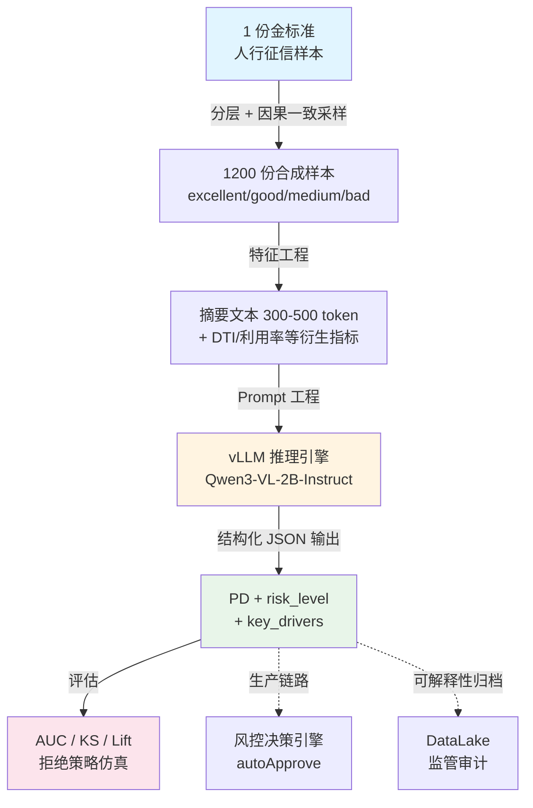
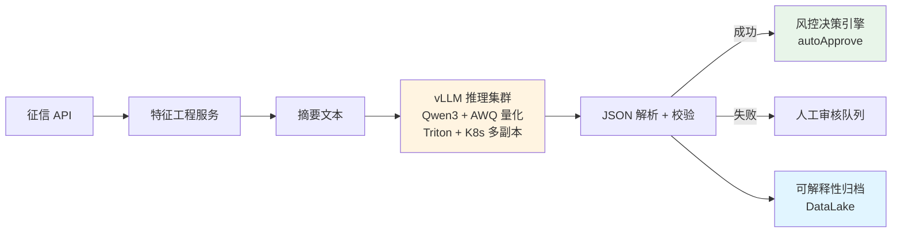

<div align="center">

# 🏦 LLM-PBoC-Credit-Risk

**基于 Qwen3-VL 本地大模型的人行征信报告批量风控解读**

*Zero-shot Personal Credit Risk Assessment with Local LLM Batch Inference*

[](https://www.python.org/)
[](https://pytorch.org/)
[](https://github.com/vllm-project/vllm)
[](https://huggingface.co/Qwen)
[](https://developer.nvidia.com/cuda-toolkit)
[](LICENSE)

**📊 AUC `0.8475`  •  KS `0.7518`  •  Top 10% Lift `7.79x`**

[快速开始](#-快速开始) • [实验结果](#-实验结果) • [架构设计](#️-架构设计) • [Prompt 工程](#-prompt-工程核心) • [工程复盘](#-工程取舍与复盘)

</div>

---

## 📌 项目简介

本项目复现了一个**零标注样本启动**的银行个贷风控原型：从 1 份人行征信报告样本出发，通过**风险分层 + 因果一致性采样**衍生 1200 份合成数据，再用本地部署的 **Qwen3-VL-2B-Instruct + vLLM** 完成批量推理，最终输出**违约概率 (PD) + 可解释归因 (key_drivers)**，并用 AUC / KS / Lift 等风控行业指标量化效果。

---

## ✨ 项目亮点

| | |
|---|---|
| 🎯 **零标注启动** | 1 份金标准样本 → 1200 份分层合成数据，无需历史违约标签 |
| ⚡ **本地批量推理** | 在 16GB 消费级 GPU 上完成 vLLM 部署，1200 份报告全跑通 |
| 🧠 **强 Prompt 工程** | 角色定位 + 评估方法论 + 风险锚点 + JSON Schema 四层设计 |
| 🔍 **完整可解释性** | 每份预测附带 `key_drivers` 自然语言归因，满足监管审计要求 |
| 🏗️ **生产化思考** | 模型选型、量化、PD 校准、偏见过滤、监控指标全链路考虑 |

---

## 🚀 快速开始

### 环境准备

```bash
# Python 3.10+
pip install torch transformers accelerate vllm numpy pandas
```

### 一键复现

```bash
git clone https://github.com/<your-username>/llm-pboc-credit-risk.git
cd llm-pboc-credit-risk/scripts

# Step 1 · 生成 1200 份样本 (~1 秒)
python generate_samples.py

# Step 2 · vLLM 批量推理 (RTX 5070 Ti ≈ 71 分钟)
python qwen_inference.py \
    --backend vllm \
    --model_path ../models/Qwen3-VL-2B-Instruct

# Step 3 · 风控指标评估
python evaluate.py
```

> 💡 无 GPU 时可用 `--backend mock` (规则版，0.1 秒跑完全部 1200 份，用于演示流程)

---

## 📊 实验结果

### 整体性能（1200 份样本）

| 指标 | 数值 | 行业基准 | 评价 |
|:---|:---:|:---:|:---:|
| **AUC** | `0.8475` | >0.8 为优秀 | ✅ |
| **KS** | `0.7518` | >0.4 为优秀 | ✅✅ |
| **Brier Score** | `0.0715` | <0.25 可用 | ✅ |
| **Top 10% Lift** | `7.79x` | >3x 可用 | ✅✅ |
| **Top 20% Lift** | `4.32x` | — | — |

### 按真实风险等级的 PD 分布

| 真实等级 | 样本数 | 平均 PD | 中位数 | 最大 PD |
|:---|:---:|:---:|:---:|:---:|
| excellent | 600 | **1.08%** | 0.00% | 45.00% |
| good | 360 | **16.66%** | 12.00% | 45.00% |
| medium | 180 | **41.25%** | 42.00% | 45.00% |
| bad | 60 | **42.38%** | 42.00% | 45.00% |

> 📌 PD 中位数随真实风险等级单调递增 (0% → 12% → 42% → 42%)，验证模型排序能力。`bad` 组最大 PD 仅 45% 反映 2B 模型的概率上界保守，可通过 isotonic calibration 校准——详见 [§工程取舍](#-工程取舍与复盘)。

### 拒绝策略仿真 (threshold = 0.4)

```
混淆矩阵: TP=74, FP=158, TN=947, FN=21

✓ 坏客户捕获率: 77.9%   (在 95 个真实坏客户中拒掉 74 个)
✓ 好客户误杀率: 14.3%   (在 1105 个真实好客户中误拒 158 个)
```

---

## 🏗️ 架构设计



---

## 📦 项目结构

```
llm-pboc-credit-risk/
├── data/
│   ├── sample_credit_report.json     # 1 份金标准征信样本 (人行格式)
│   └── samples/                       # 1200 份衍生样本
│       ├── report_00001.json
│       └── _index.json                # 索引及风险分层统计
├── scripts/
│   ├── generate_samples.py            # 样本生成 (分层 + 因果一致)
│   ├── feature_engineering.py         # 特征工程 + 摘要文本
│   ├── qwen_inference.py              # vLLM 批量推理
│   └── evaluate.py                    # 风控指标评估
├── models/
│   └── Qwen3-VL-2B-Instruct/         # 本地模型权重 (需自行下载)
├── output/
│   └── predictions.jsonl              # 模型预测结果
└── logs/
    ├── generate_samples.log
    ├── qwen_inference.log
    └── evaluate.log
```

---

## 🔧 技术栈

| 类别 | 选型 |
|---|---|
| **OS / Runtime** | Windows 11 + WSL2 Ubuntu 22.04 / Python 3.12 |
| **GPU** | NVIDIA RTX 5070 Ti (16 GB VRAM) / CUDA 13.1 |
| **推理框架** | vLLM 0.20.2 (FlashAttention v2 后端) |
| **大模型** | Qwen3-VL-2B-Instruct (BF16, ~4.24 GB) |
| **评估** | NumPy / Pandas / scikit-learn 风格指标 |

<details>
<summary><b>📋 关于模型选型的工程决策（点击展开）</b></summary>

| 候选模型 | 显存占用 | 本机能否运行 | 备注 |
|---|---|:---:|---|
| Qwen2.5-7B-Instruct (BF16) | ~16 GB | ❌ | 权重加载后 KV cache 空间不足 |
| Qwen2.5-7B-AWQ-4bit | ~6 GB | ✅ | 后续优化方向 |
| **Qwen3-VL-2B-Instruct (BF16)** | ~4.24 GB | ✅ | 当前选型 |

原计划使用 7B 模型，但在 16GB 显存下加载完权重后剩余 KV cache 空间过少 (<2GB)，无法支撑 2048 token 的上下文窗口，**最终降级为 2B 模型**。这是消费级 GPU 部署 LLM 时的典型工程取舍——参数量、上下文长度、并发数三者必须权衡。

</details>

---

## 🧠 Prompt 工程（核心）

Prompt 设计决定 **>50%** 的最终效果。本项目的 `SYSTEM_PROMPT` 由四层组件构成：

### ① 专家角色定位

```
你是一名资深银行风控建模专家，
精通中国人民银行征信报告解读和个人信贷违约预测。
```

### ② 评估方法论（避免模型自由发挥）

明确告诉模型"看哪些指标、按什么权重"：

```
1. 现金流压力      —— DTI > 70% 是高风险信号
2. 履约历史        —— 24 月逾期表现是最强单变量信号
3. 信贷渴求度      —— 近 3 月查询 > 6 次提示资金紧张
4. 公共负面记录    —— 任何司法记录都应大幅提升 PD
5. 信用卡利用率    —— > 80% 提示流动性紧张
```

### ③ 风险分层锚点（防止概率漂移）

```
低风险   (PD < 5%)    征信干净，DTI < 50%，查询合理
中风险   (PD 5-15%)   轻微利用率偏高，无实质逾期
高风险   (PD 15-40%)  M1/M2 逾期，或 DTI > 70%
极高风险 (PD > 40%)   当前逾期、M3+、公共记录或多项叠加
```

### ④ 严格 JSON 输出 Schema

```json
{
  "overdue_probability": 0.0850,
  "risk_level": "中风险",
  "key_drivers": ["驱动因素1", "..."],
  "explanation": "...",
  "recommendation": "批准",
  "suggested_credit_limit_ratio": 0.8
}
```

> 📌 本次 1200 份样本的 JSON 解析成功率: **100% (1200/1200)**

<details>
<summary><b>🔍 真实输出样例（点击展开）</b></summary>

```json
{
  "report_id": "PBC-2026-00026",
  "true_label": 1,
  "true_severity": "bad",
  "features": {"dti": 2.14, "utilization": 0.86, ...},
  "model_output": {
    "overdue_probability": 0.42,
    "risk_level": "极高风险",
    "key_drivers": [
      "当前存在逾期金额 32,031 元 (强烈负面)",
      "24月内出现 M4(91-120天) 逾期 (严重负面)",
      "最近 3 月有 6 个账户发生逾期 (近期恶化)",
      "负债收入比 214% 已超过月收入 (严重现金流压力)",
      "信用卡利用率 86% 偏高",
      "存在 1 项强制执行记录 (失信)"
    ],
    "recommendation": "拒绝",
    "suggested_credit_limit_ratio": 0.0
  }
}
```

</details>

---

## 📐 数据与特征工程

### 1200 份样本的分层生成

不能简单"随机扰动"——会破坏字段间业务逻辑。采用 **风险分层 + 因果一致采样**：

| 风险等级 | 占比 | 真实 6 月逾期率 | 字段联合分布 |
|---|:---:|:---:|---|
| excellent | 50% | ~1% | 利用率低 → 无逾期 → 查询合理 → 公共记录干净 |
| good | 30% | ~5% | 利用率轻微偏高，但无实质逾期 |
| medium | 15% | ~25% | 出现 M1/M2，DTI 偏高，近期查询多 |
| bad | 5% | ~65% | 当前逾期 / M3+ / 公共记录 / DTI 爆表 |

> 对标中国商业银行个贷不良率 1-3% + 关注类 5-8% 的真实客群分布。

### 特征工程：压缩 + 衍生

原始 JSON 平均 2-5K tokens，直接喂给 LLM 会面临三大痛点：推理慢、关键信号被淹没、数值字段 token 利用率低。

**解决方案**：压缩为 **300-500 token 的中文摘要** + 补充 LLM 算不出的衍生指标

```text
【个人基本信息】
年龄: 35岁, 学历: 本科, 职业: 工程师, 月收入: 2.5万元

【信贷账户概要】
- 贷款账户数: 3 个, 贷款余额合计: 85.0 万元
- 信用卡数: 4 张, 总体利用率: 17.5%
- 负债收入比(DTI): 39.0%

【逾期表现】
- 当前逾期金额: 0 元
- 24 个月内逾期账户数: 0, 累计逾期次数: 0
- 最长逾期等级: 无逾期
- 最近 3 个月发生逾期的账户数: 0

【公共记录】
- 民事判决: 0 项, 强制执行: 0 项, 税收欠缴: 0 项

【近期信贷需求】
- 近 3 月机构查询: 2 次 (贷款审批 1 次)
- 近 6 月机构查询: 4 次
```

**关键衍生指标**：

- `DTI` = `(月供合计 + 信用卡已用 × 10%) / 月收入`，>70% 为高危
- `high_util_cards` = 利用率 ≥80% 的信用卡数（流动性紧张信号）
- `recent_overdue_3m` = 近 3 月新增逾期账户数（捕捉"近期恶化"）

---

## ⚙️ vLLM 部署细节

### 关键配置

```python
LLM(
    model="../models/Qwen3-VL-2B-Instruct",
    trust_remote_code=True,
    dtype="bfloat16",
    max_model_len=2048,
    gpu_memory_utilization=0.9,
    max_num_seqs=1,           # 16GB 显存下的实际并发上限
    enforce_eager=True,       # 关闭 CUDAGraph 节省显存
)
```

### 实测性能（RTX 5070 Ti, 16GB）

| 指标 | 实测值 |
|---|---|
| 模型加载耗时 | 16.6 s |
| 1200 份推理总耗时 | **4256.7 s (≈ 71 min)** |
| 平均单份耗时 | **3547 ms** |
| 显存峰值 | ~14 GB / 16 GB |
| KV cache 容量 | 76,144 tokens (理论并发 37x) |
| JSON 解析成功率 | **100% (1200/1200)** |

<details>
<summary><b>📜 vLLM 加载日志关键行（点击展开）</b></summary>

```
INFO [model.py:555]   Resolved architecture: Qwen3VLForConditionalGeneration
INFO [model.py:1680]  Using max model len 2048
INFO [gpu_model_runner] Model loading took 4.24 GiB memory and 1.63 seconds
INFO [gpu_worker]     Available KV cache memory: 8.13 GiB
INFO [kv_cache_utils] GPU KV cache size: 76,144 tokens
INFO [kv_cache_utils] Maximum concurrency for 2,048 tokens per request: 37.18x
INFO [core.py:306]    init engine took 16.57 s
```

</details>

---

## 💡 工程取舍与复盘

### 性能优化路线图

| 优化项 | 预期收益 | 实施难度 | 优先级 |
|---|---|:---:|:---:|
| AWQ / GPTQ 4bit 量化 | 显存 −60%、吞吐 +30% | 中 | ⭐⭐⭐ |
| `max_num_seqs` 提升到 8-16 | 吞吐 5-10x | 低 | ⭐⭐⭐ |
| Prefix Caching (系统提示复用) | 输入 token −80% | 低（vLLM 内置） | ⭐⭐⭐ |
| 升级到 7B + AWQ | KS 预计 +0.05 | 中 | ⭐⭐ |
| 批量请求合并 | 吞吐 +50% | 低 | ⭐⭐ |

### LLM 方案 vs 传统评分卡

| 维度 | 传统 LR / XGB | **LLM 方案** |
|---|---|---|
| 训练数据 | 需 10万+ 历史样本 | **0 训练样本** (prompt 即模型) |
| 上线速度 | 3-6 个月 | **1-2 周** |
| 解释性 | 弱（系数数字） | **强**（自然语言归因） |
| 极端场景 | 需重新建模 | 改 prompt 即可 |
| 推理延迟 | <1 ms | 100-3500 ms |
| 监管合规 | 成熟 | 需输出可审计 `key_drivers` |

> **🎯 最佳实践**：LLM 用于**冷启动 / 长尾客群 / 反欺诈说明 / 人审辅助**；评分卡用于**主流量自动审批**。两者并行，LLM 输出 `key_drivers` 作为评分卡决策的可解释性补充。

### 已观察到的模型行为问题

1. **概率上界保守**：`bad` 组最大 PD 仅 45%，2B 模型缺少 PD 极端值的输出倾向
2. **改进方向**：
   - 用 isotonic regression / Platt scaling 校准到真实违约率
   - 不同客群用不同 cutoff（分层阈值），而非全局 0.4
   - 把 `key_drivers` 作为 XGB 的文本特征，融合 LLM + 评分卡

---

## 🛣️ 生产化建议

### 部署架构（推荐）



### 偏见与合规

- ❌ **不让模型看到**姓名、性别、民族等保护特征 → 已在特征工程阶段过滤
- ✅ `key_drivers` 中禁止出现性别 / 地域歧视性表述 → prompt 约束 + 后处理过滤
- ✅ 所有 `key_drivers` 入库归档，满足监管"可解释、可追溯"

### 生产监控指标

| 指标 | 触发动作 |
|---|---|
| PSI > 0.25 (输入分布漂移) | 告警 + 评估重训 |
| KS 周度回测下降 > 0.05 | 触发模型 review |
| JSON 解析失败率 > 1% | 升级 prompt / 改用 JSON Schema 工具调用 |
| 人审反转率 > 10% | 重新校准阈值 |

---

## 📚 参考资料

- [vLLM 官方文档](https://docs.vllm.ai/)
- [Qwen3-VL 模型卡](https://huggingface.co/Qwen)

---

## 📝 License

[MIT License](LICENSE) © 2026

---

<div align="center">

**如果这个项目对你有帮助，欢迎 ⭐ Star**

</div>
